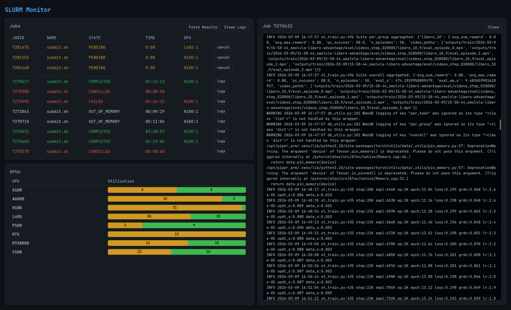

# slurm-tools

CLI for submitting SLURM jobs via SSH and a web GUI for monitoring them.

## Install

```bash
uv pip install git+https://github.com/reeceomahoney/slurm-tools.git
```

## Configuration

Place a `configs/slurm.yaml` in your working directory:

```yaml
host: my-cluster
remote_path: /data/user/project
command: >-
  singularity run --nv container.sif make train
time: 6
gpu: h100
ngpu: 1
cpus: 16
mem: 8G
priority: true
envs:
  - WANDB_API_KEY
  - HF_TOKEN
```

If no config file exists, all options fall back to dataclass defaults and can be set entirely via CLI flags.

## Usage

### Submit a job

```bash
slurm run                          # uses configs/slurm.yaml
slurm run --gpu l40s --time 3      # override specific fields
slurm run --command "make eval"    # override command
slurm run --dry_run true           # print the sbatch script without submitting
```

This rsyncs the project to the remote host (respecting `.gitignore`), then submits via `sbatch`.

### Web GUI

```bash
slurm gui           # start the monitoring server on localhost:5000
slurm gui stop      # stop it
```

The GUI shows GPU availability across nodes, running/completed jobs, log streaming, and supports cancelling jobs. The GUI requires the host is set in `configs/slurm.yaml`. Use your alias from your ssh config and make sure you have an ssh key setup.



## Config reference

| Field         | Default | Description                        |
| ------------- | ------- | ---------------------------------- |
| `host`        | **required** | SSH host alias for the cluster     |
| `remote_path` | **required** | Absolute path on the remote host   |
| `command`     | **required** | Shell command to run in the job    |
| `time`        | `6`     | Job time limit in hours            |
| `gpu`         | `h100`  | GPU type for typed GRES (e.g. h100, l40s); leave empty for `gpu:N` |
| `ngpu`        | `1`     | Number of GPUs                     |
| `cpus`        | `16`    | CPUs per node                      |
| `mem`         | `8G`    | Memory per CPU                     |
| `priority`    | `false` | Use priority credits (if available)|
| `dry_run`     | `false` | Print sbatch script without submit |
| `envs`        | `[]`    | Names of local env vars to forward into the job (see below) |

### Forwarding environment variables

Use `envs` to forward secrets like `WANDB_API_KEY` or `HF_TOKEN` from your
local shell into the job without committing them. At submit time, each
listed name is read from your local environment and prepended to the sbatch
script as a quoted `export VAR=...` line. The variable must be set locally
or submission errors out. Names in `envs` are forwarded literally — they are
not interpolated into `command`, so write them once in `envs` rather than as
`${VAR}` references in the script body.
